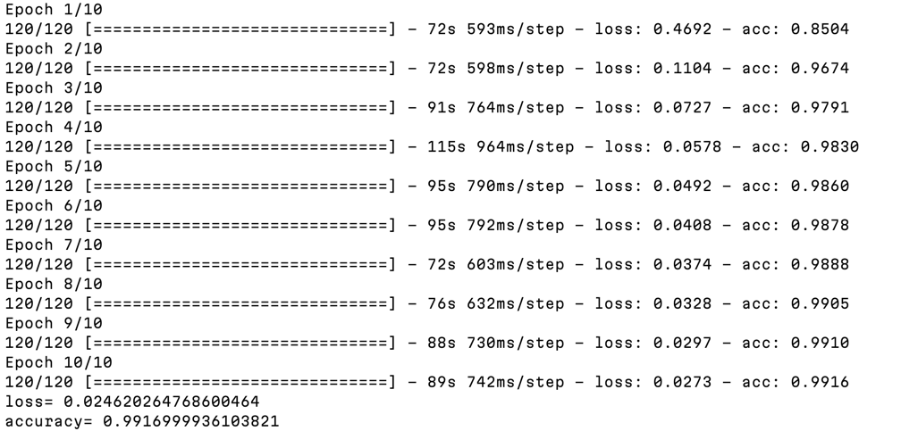

## Дорохов Георгий 3530904/90106

### Сверточные сети 

В работе использовалась библитеока tensorflow и датасет MNIST.

Благодаря подходу в обучении - data augmentation (Смещение по высоте) удалось добиться больше 99% точности 

Работу можно считать успешно выполненой